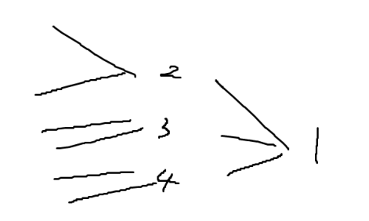
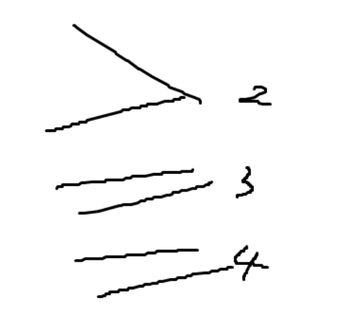

# [线段树存multiset](http://124.223.9.166/contest/1049/problem/3-3)

## 题意

描述

你通过了蓝鸟的考验，成为了DHUACM的中枢。

现在，你需要为队员们制定一个评分表，以监督队员们的训练状况。

具体来说，有 *n* 名队员，第 *i* 名队员的评分是 *a**i* 。

接下来，你需要按顺序执行 *q* 次操作，有以下两种：

1. `1 x val` 表示将第 *x* 名队员的评分改为 *v**a**l* 。
2. `2 l r val` 输出区间 [*l*,*r*] 的队员的评分中小于等于 *v**a**l* 的最大评分开除警告，若不存在输出 −1。

输入描述

第一行，包含两个整数， *n*,*q* （1≤*n*,*q*≤2×105）。

第二行，包含 *n* 个整数，第 *i* 个整数为 *a**i* （1≤*a**i*≤109）。

接下来 *q* 行，每行第一个整数表示操作类型：

1. 若是第一种操作，则接下来包含两个整数 *x*,*v**a**l* （1≤*x*≤*n*,1≤*v**a**l*≤109）。
2. 若是第二种操作，则接下来包含三个整数 *l*,*r*,*v**a**l* （1≤*l*≤*r*≤*n*,1≤*v**a**l*≤109）。

输出描述

对于每一次第二种操作，输出一行，包含一个整数，表示答案。

用例输入 1 

```
10 4
1 2 3 4 5 6 7 8 9 10
1 6 5
2 1 10 5
2 1 2 5
2 5 6 4
```

用例输出 1 

```
5
2
-1
```

## 思路

我们建立一棵线段树，对于每个线段树上的维护 的节点，建立一个multiset，维护[l, r]的所有数字
我们进行区间查询时，对线段树划分到的每个区间的multiset进行uppper_bound
线段树共log n层，每层multiset的总点数是n，维护multiset的代价是log n
时间复杂度O(n log^2^n)

## 代码

```c++
#include<bits/stdc++.h>
using namespace std;

typedef long long ll;
#define all(x) x.begin(), x.end()
#define rep(i, n) for(ll i = 0; i < (n); i++)
#define rep1(i, n) for(ll i = 1; i <= (n); i++)
#define drep(i, n) for(ll i = (n) - 1; i >= 0; i--)
#define drep1(i, n) for(ll i = (n); i > 0; i--)

struct SegmentTree{
    int n;
    vector<multiset<ll>> info;
    void pull(int p){
        info[p] = multiset<ll>();
        for(auto x: info[2 * p]){
            info[p].insert(x);
        }
        for(auto x: info[2 * p + 1]){
            info[p].insert(x);
        }
    }
    SegmentTree(vector<ll> init_){
        n = init_.size();
        info.assign(4 * n, multiset<ll>());
        function<void(int, int, int)> build = [&](int p, int l, int r){
            if(r - l == 1){
                info[p] = multiset<ll>{init_[l]};
                return;
            }
            int m = (l + r) / 2;
            build(2 * p, l, m);
            build(2 * p + 1, m, r);
            pull(p);
        };
        build(1, 0, n);
    }
    void modify(int p, int l, int r, int x, const ll v, const ll pre){
        info[p].extract(pre);
        info[p].insert(v);
        if(r - l == 1){
            return;
        }
        int m = (l + r) / 2;
        if(x < m){
            modify(2 * p, l, m, x, v, pre);
        }
        else{
            modify(2 * p + 1, m, r, x, v, pre);
        }
    }
    void modify(int x, const ll v, const ll pre){
        modify(1, 0, n, x, v, pre);
    }
    ll rangeQuery(int p, int l, int r, int x, int y, const ll val){
        if(l >= y || r <= x){
            return -1;
        }
        if(l >= x && r <= y){
            auto it = info[p].upper_bound(val);
            if(it != info[p].begin()){
                return *(prev(it));
            }
            else{
                return -1;
            }
        }
        int m = (l + r) / 2;
        return max(rangeQuery(2 * p, l, m, x, y, val), rangeQuery(2 * p + 1, m, r, x, y, val));
    }
    ll rangeQuery(int l, int r, ll val){
        return rangeQuery(1, 0, n, l, r, val);
    }
};

void solve(){
    ll n, q;
    cin >> n >> q;
    vector<ll> a(n);
    rep(i, n){
        cin >> a[i];
    }

    SegmentTree segt(a);

    while(q--){
        ll op;
        cin >> op;
        if(op == 1){
            ll x, val;
            cin >> x >> val;
            x--;
            segt.modify(x, val, a[x]);
            a[x] = val;
        }
        else if(op == 2){
            ll l, r, val;
            cin >> l >> r >> val;
            l--;
            ll res = segt.rangeQuery(l, r, val);
            cout << res << "\n";
        }
    }
}

int main(){
    ios::sync_with_stdio(false);
    cin.tie(0);

    solve();

    return 0;
}
```


# [状压dp](http://124.223.9.166/contest/1049/problem/3-1)

## 题意

描述

选拔赛结束之后，DHUACM的中枢蓝鸟哥哥想让你汇报这些选手的表现情况，而他的要求非常奇怪。

这场比赛有 *n* 名选手参加，第 *i* 名选手的表现分为 *a**i* 。

蓝鸟会让你进行 *q* 场报告，每次会给你一个 01 串 *s* 。若 *s* 中第 *i* 个数为 0 时，表示你的报告中**不能包括**第 *i* 个选手的表现，否则你可以选择**包括或者不包括**（每名选手在一次报告中最多被包括一次）。

蓝鸟定义一场报告的价值为报告所包括的选手的表现分的异或和。

现在，你想知道对于你的每场报告，这场报告可能的价值的最大值。

输入描述

第一行，包含两个整数， *n*,*q* （1≤*n*≤20,1≤*q*≤105） 。

第二行，包含 *n* 个整数，第 *i* 个整数为 *a**i* （1≤*a**i*≤109）。

接下来 *q* 行，每行包含一个长度为 *n* 的 01 串 *s* 。

输出描述

输出 *q* 行，每行包含一个整数，表示答案。

用例输入 1 

```
3 8
2 5 9
000
100
010
110
001
101
011
111
```

用例输出 1 

```
0
2
5
7
9
11
12
14
```

## 代码

```c++
#include<bits/stdc++.h>
using namespace std;

typedef long long ll;
#define all(x) x.begin(), x.end()
#define rep(i, n) for(ll i = 0; i < (n); i++)
#define rep1(i, n) for(ll i = 1; i <= (n); i++)
#define drep(i, n) for(ll i = (n) - 1; i >= 0; i--)
#define drep1(i, n) for(ll i = (n); i > 0; i--)

void solve(){
    ll n, q;
    cin >> n >> q;
    vector<ll> a(n);
    rep(i, n){
        cin >> a[i];
    }

    vector<ll> dp((1LL << n), 0);
    for(ll mask = 0; mask < (1LL << n); mask++){
        ll res = 0;
        for(ll i = 0; i < n; i++){
            if(mask & (1LL << i)){
                res ^= a[i];
            }
        }
        dp[mask] = res;
    }

    for(ll mask = 0; mask < (1LL << n); mask++){
        for(ll i = 0; i < n; i++){
            if(mask & (1LL << i)){
                dp[mask] = max(dp[mask], dp[mask ^ (1LL << i)]);
            }
        }
    }

    while(q--){
        string s;
        cin >> s;

        ll mask = 0;
        for(ll i = 0; i < n; i++){
            if(s[i] == '1'){
                mask ^= (1LL << i);
            }
        }

        ll ans = dp[mask];
        cout << ans << "\n";
    }
}

int main(){
    ios::sync_with_stdio(false);
    cin.tie(0);

    solve();

    return 0;
}
```


# [反悔贪心](http://124.223.9.166/contest/1049/problem/2-4)

## 题意

描述

在你的不懈努力青山哥哥的调教之下，你成为了算竞高手，现在你被任命为DHU的天梯赛选拔赛出题人。

这场选拔赛你一共出了 *n* 道题。你对题目难度了如指掌，知道对于第 *i* 题，青山哥哥需要花费 *a**i* 的时间完成，而其他人需要花费 *b**i* 的时间完成。无论是谁，同一时间只能思考一道题，不存在线程撕裂者。

青山哥哥非常厉害，他的目标不只是AK比赛，还要拿到更多的一血，因为这样凡凡就会给他更多的奖励。

而其他人没有青山哥哥这么厉害，目标只是AK比赛，所以每次会优先选择**耗时最少的题目**完成。

青山哥哥比赛前来问你，他在最优策略下，他最多能拿多少一血。

> 一血：对于某道题，最早完成它（可以并列），则称拿到这道题的一血。

输入描述

第一行，包含一个整数，*n* （1≤*n*≤105）。

第二行，包含 *n* 个整数，第 *i* 个整数为 *a**i* （1≤*a**i*≤109）。

第三行，包含 *n* 个整数，第 *i* 个整数为 *b**i* （1≤*b**i*≤109），保证 *b**i* 各不相同。

输出描述

输出一个整数，表示答案。

用例输入 1 

```
6
10 10 10 310 260 320
10 100 110 120 130 140
```

用例输出 1 

```
5
```

## 思路

比较经典的反悔贪心
[【学习笔记】反悔贪心 - Koshkaaa (cnblogs.com)](https://www.cnblogs.com/RioTian/p/14513549.html)
你会发现其他人的做题顺序与每道题完成的总用时都是固定的
先排个序求个和就可以确定
我们如何确定青山哥哥的做题顺序
我们可以记录一下当前青山哥哥的总用时sum
我们尝试做一下当前的题目，如果你发现sum + 当前题目的开销，是优于其他人的时间的
所以我们就可以让答案+1，此时我们吃下这道题，并且把这道题的时间加到sum上
如果不行呢？这道题仍然有用，我们可以看看之前做的所有题中，时间开销最大的一道题，是否大于当前题目，如果是，我们就可以把之前那道题踢掉，改做当前的题目
这样虽然不影响答案的数值（总做题数），但是我们优化了青山哥哥的总时间开销，未来就更有可能做更多题

## 代码

```c++
#include<bits/stdc++.h>
using namespace std;

typedef long long ll;
#define all(x) x.begin(), x.end()
#define rep(i, n) for(ll i = 0; i < (n); i++)
#define rep1(i, n) for(ll i = 1; i <= (n); i++)
#define drep(i, n) for(ll i = (n) - 1; i >= 0; i--)
#define drep1(i, n) for(ll i = (n); i > 0; i--)

void solve(){
    ll n;
    cin >> n;
    vector t(n, array<ll,2>());
    rep(i, n){
        cin >> t[i][1];
    }
    rep(i, n){
        cin >> t[i][0];
    }

    sort(all(t));
    priority_queue<ll> pque;
    ll sum = 0, lim = 0, ans = 0;
    rep(i, n){
        auto [b, a] = t[i];
        lim += b;
        if(sum + a <= lim){
            sum += a;
            pque.push(a);
        }
        else if(!pque.empty() && a < pque.top()){
            sum -= pque.top();
            sum += a;
            pque.pop();
            pque.push(a);
        }

        ans = max(ans, (ll)pque.size());
    }

    cout << ans;
}

int main(){
    ios::sync_with_stdio(false);
    cin.tie(0);

    solve();

    return 0;
}
```


# [反图拓扑](http://124.223.9.166/contest/1049/problem/2-3)

## 题意

描述

你很快解决了旭阳哥哥的见面礼，真正的算竞大佬青山哥哥听闻此事，觉得你是个学算竞的料。

于是，他给了你一份有 *n* 道题的题单，题目的编号为 1∼*n* ，让你把它们全部完成。

青山告诉你，这份题单里的有些题，你需要先完成其他的相关题目才能完成它，否则你会被题目难度劝退，青山可不希望你提桶跑路。

具体来说，青山会告诉你 *m* 个二元组 (*u*,*v*) ，表示第 *u* 道题必须在第 *v* 道题之前完成。

同时，这份题单是青山精心准备的，所以编号越小的题越重要，你需要尽可能优先完成编号较小的题。

若你能完成这份题单，你需要按完成的顺序输出题目编号；若你不能，则输出字符串 `TAI NAN LE!` 。

输入描述

第一行，包含两个整数，*n*,*m* （1≤*n*,*m*≤105）。

接下来 *m* 行，每行包含两个整数， *u*,*v* (1≤*u*,*v*≤*n*) 。

输出描述

若你能完成这份题单，你需要输出一行，包含 *n* 个整数，表示答案；若你不能，则输出字符串 `TAI NAN LE!` 。

用例输入 1 

```
6 6
3 1
2 1
1 4
2 5
5 4
6 2
```

用例输出 1 

```
6 2 3 1 5 4
```

用例输入 2 

```
6 8
1 2
1 4
1 3
2 4
3 4
5 3
4 5
6 4
```

用例输出 2 

```
TAI NAN LE!
```

用例输入 3 

```
3 1
3 1
```

用例输出 3 

```
3 1 2
```

提示

对于第一组样例：
因为编号小的优先，因此优先完成1，在完成1的过程，需要优先先完成2，完成2的过程需要先完成6……，因此得到6 2 3 1

接下来2完成，3完成，因此优先完成4，得到5 4
最后：6 2 3 1 5 4

对于第三组样例：需要尽可能先完成较小的编号，因此目标是先完成1。故先完成3 1，最后完成2，得到答案3 1 2

## 思路

题意说实话非常抽象
我们需要先完成1，那就要把1的前驱全部完成
并且对于1的所有前驱，我们显然也要按最小的开始完成
假设只有一个连通块

我们可以考虑删除点1，代表1需要最后完成
然后选择下一个连通块继续执行

对于2 3 4三个连通块，我们选一个连通块做事，注意定义：最后完成
因此我们肯定选的是4 3 2的顺序
每次删除一个点，就会多出一些连通块，在这些连通块中，选择最大值删
这是一个倒序的过程（最后完成）
二元组 (u,v) ，第 u 道题必须在第 v 道题前完成
我们可以建一条v到u的反边
进行拓扑排序，并且拓扑排序要求：使用优先队列，选出最大的节点优先进行拓扑
得到的拓扑序反过来就是正解。
[拓扑排序（Topological Sorting)-CSDN博客](https://blog.csdn.net/lisonglisonglisong/article/details/45543451)

## 代码

```c++
#include<bits/stdc++.h>
using namespace std;

typedef long long ll;
#define all(x) x.begin(), x.end()
#define rep(i, n) for(ll i = 0; i < (n); i++)
#define rep1(i, n) for(ll i = 1; i <= (n); i++)
#define drep(i, n) for(ll i = (n) - 1; i >= 0; i--)
#define drep1(i, n) for(ll i = (n); i > 0; i--)

void solve(){
    ll n, m;
    cin >> n >> m;
    vector graph(n + 1, vector<ll>());
    vector<ll> ind(n + 1, 0);
    rep(i, m){
        ll u, v;
        cin >> u >> v;
        graph[v].push_back(u);
        ind[u]++;
    }

    priority_queue<ll> pque;
    rep1(i, n){
        if(ind[i] == 0){
            pque.push(i);
        }
    }

    stack<ll> ans;
    while(!pque.empty()){
        ll v = pque.top();
        pque.pop();
        ans.push(v);

        for(auto u: graph[v]){
            ind[u]--;
            if(ind[u] == 0){
                pque.push(u);
            }
        }
    }

    if(ans.size() != n){
        cout << "TAI NAN LE!";
    }
    else{
        while(!ans.empty()){
            cout << ans.top() << " ";
            ans.pop();
        }
    }
}

int main(){
    ios::sync_with_stdio(false);
    cin.tie(0);

    solve();

    return 0;
}
```

